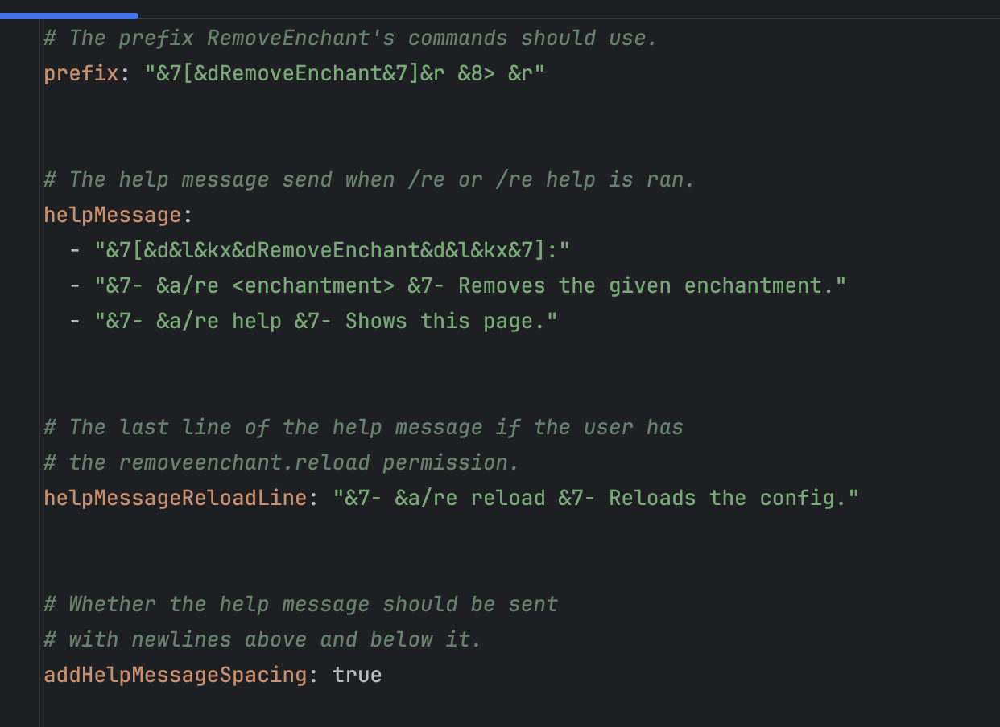

# RemoveEnchant
### A Spigot plugin that allows you to remove specific enchantments from items!
[RemoveEnchant's Page on SpigotMC.org](https://www.spigotmc.org/resources/removeenchant.114428/)

## This plugin was created for FoxCraft!
IP: `play.ilikefoxes.com`

Web: www.ilikefoxes.com

## Screenshots:
#### Help page:

#### The command to remove silk touch from your held item:

#### Result after typing /re silk touch:

#### Config file:

## Features:
- Configurable plugin message prefix.
- Configurable plugin help message.
- Enchantment tab-completion.

## Command Aliases:
- The main command is `/removeenchant`
- It has two aliases:
  - `/re`
  - `/removeenchantment`

## Commands:
- `/re help` - Displays the help page.
- `/re <enchantment name>` - Removes the given enchantment from your held item.
- `/re reload` - Reloads the plugin.

## Permissions:
- `removeenchant.use` - Permission to use any /removeenchant command.
- `removeenchant.reload` - Permission to reload the plugin's config.
